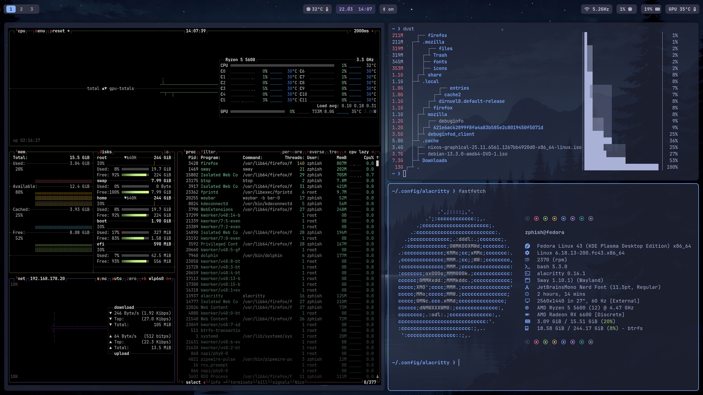

# swayfx-config

A personal Linux desktop configuration repo for a clean, minimal, and highly customizable Sway-based setup.


This repository collects my configuration files for the desktop, including:

* **Sway / SwayFX** window manager setup
* **Waybar** status bar styles and layouts
* **Alacritty** terminal themes
* **Wofi** launcher styling
* **Fastfetch** configuration
* Shell aliases and small helper scripts

---

## Preview

Add screenshots of your desktop here so people can see the theme, bar, launcher, and terminal at a glance.


If you do not have these files yet, create them first and replace the paths above with the real image filenames in the repository.

---

## What is included

### `sway/`

Main Sway configuration files.

* `config` — main Sway config
* `keybinds.conf` — keybindings
* `theme.conf` — theme variables and colors
* `themeTokyo.conf` — alternate Tokyo Night theme
* `changeWallpaper.sh` — wallpaper switcher script

### `waybar/`

Waybar configuration and style files.

* `config.jsonc` — bar layout and modules
* `style.css` — visual styling
* `staticStyle`, `coluredStyle`, `unixpStyle` — alternate style presets

### `alacritty/`

Terminal configuration and themes.

* `alacritty.toml` — main Alacritty configuration
* several theme files such as `dracula.toml`, `nord.toml`, `tokyo-night.toml`, and more

### `wofi/`

Launcher configuration and CSS.

* `config` — launcher settings
* `style.css` — main style
* `style1` — alternate style

### `bashrc.d/`

Shell aliases and small shell customizations.

### Other files

* `fastfetch-config.jsonc` — Fastfetch configuration
* `gitBackupConfig.sh` — backup helper script
* `Pictures/` — wallpapers and screenshots used by the setup

---

## Screenshot gallery


```md

```


```md

```


---

## Installation

You will need to install the following packages:

swayfx
alacritty
wofi
fastfetch
waybar
nerd font
swayosd
grim
slurp
cliphist


1. Clone the repository:

```bash
git clone https://github.com/Projekt-Boss/swayfx-config.git
cd swayfx-config
```

2. Copy the files to the correct config locations.

Examples:

```bash
mkdir -p ~/.config
cp -r sway ~/.config/
cp -r waybar ~/.config/
cp -r alacritty ~/.config/
cp -r wofi ~/.config/
```

3. Make scripts executable if needed:

```bash
chmod +x sway/changeWallpaper.sh gitBackupConfig.sh
```

4. Restart Sway or reload the config:

```bash
swaymsg reload
```

---


## Notes

This repository is meant as a personal desktop configuration and theme archive. Feel free to use parts of it as a starting point for your own setup.

---
